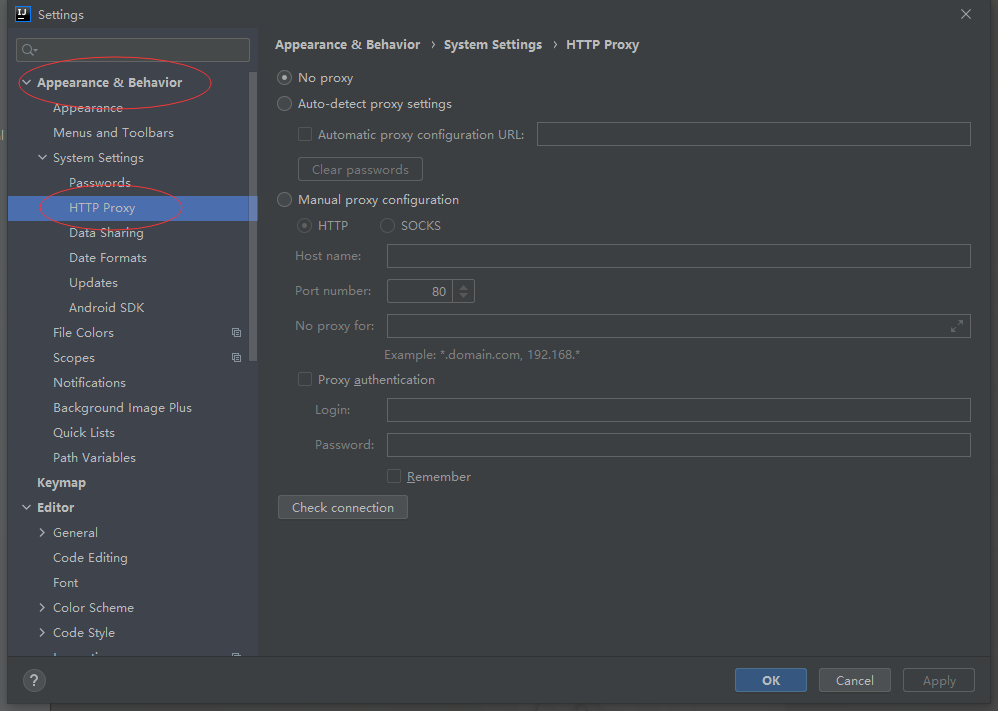
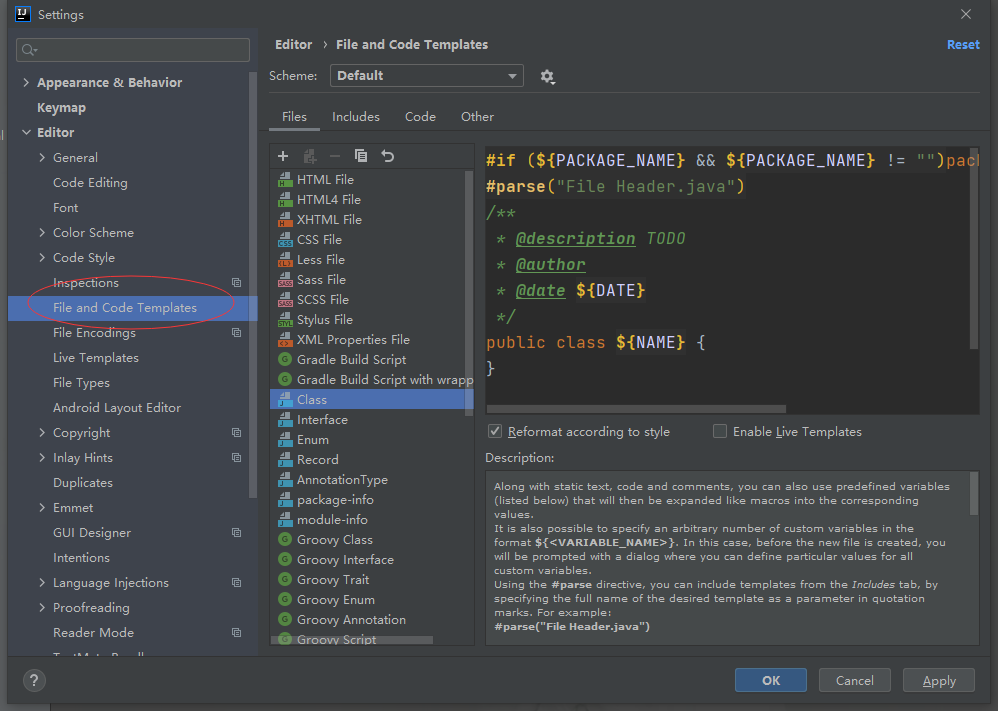
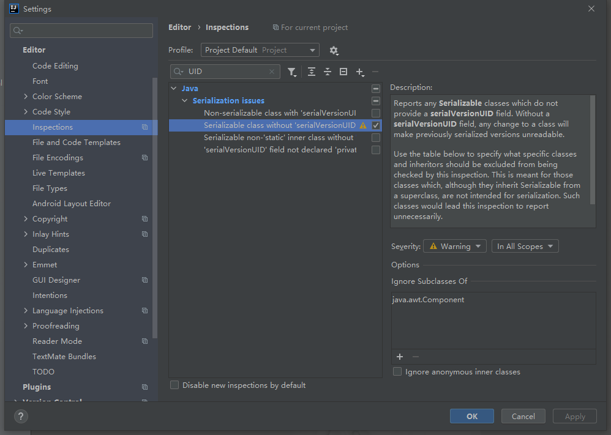
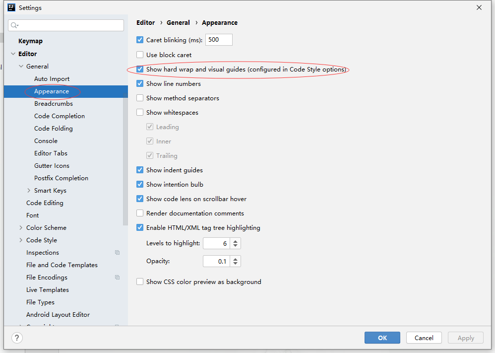
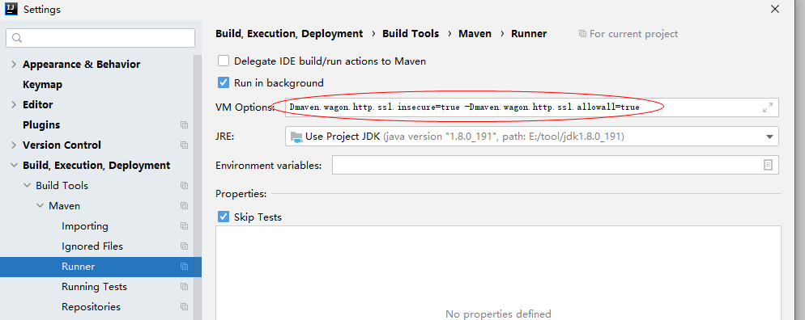

## 插件

| 名字                  | 描述     |
| :-------------------- | -------- |
| SonarLint             | 代码质量 |
| Rainbow Brackets      | 彩虹括号 |
| Maven Helper          | jar冲突  |
| JRebel                | 热部署   |
| Background Image Plus | 背景     |


## 默认打开项目


## 代理



## 类注释



```java
/**
 * @description TODO 
 * @author 
 * @date ${DATE}
 */
```

## 序列化


## 右边中竖线



## Maven

### ssl
